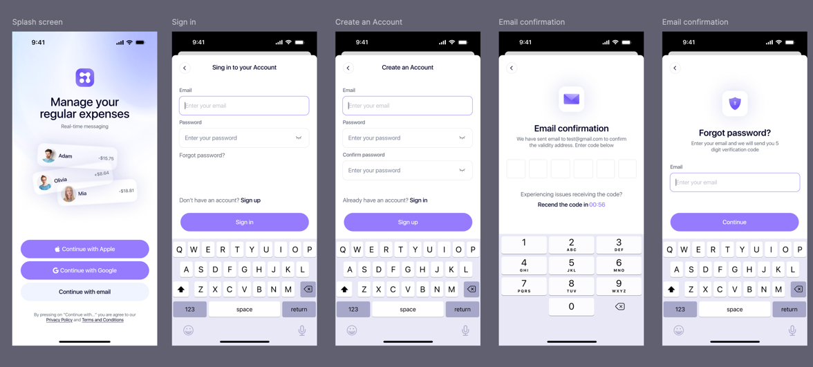
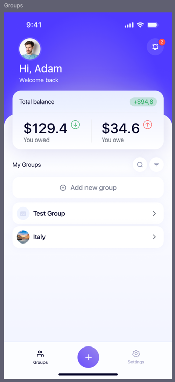
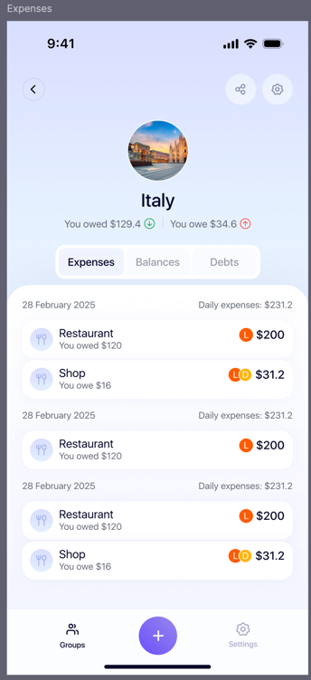
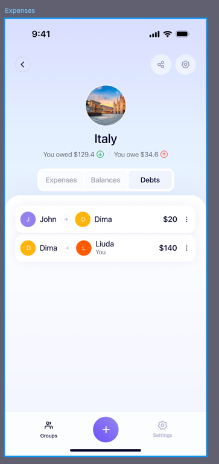
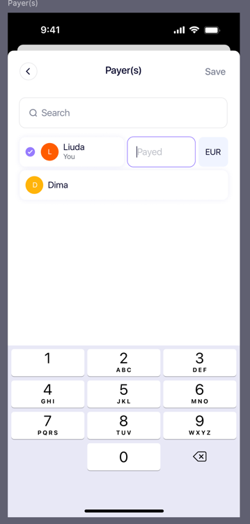
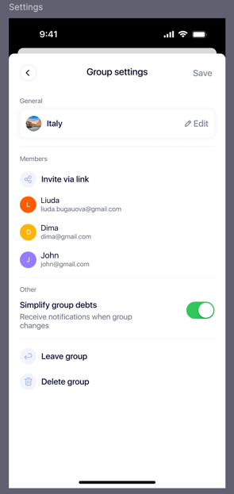
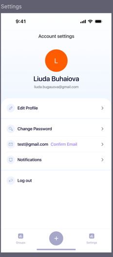

# 💸 SplitTrip — Group Expense & Debt Tracker

**SplitTrip** is a simple and intuitive app for tracking shared expenses and debts within a group. Perfect for trips, events, shared households, or any situation where you need to keep track of who owes what.

---

## 📱 Screenshots

  
  
  
  
  
  
  

---

## 🚀 Features

- Create groups with multiple members
- Add expenses: who paid, for whom
- Automatic calculation of individual balances
- View full history of transactions
- Multi-currency support 💱
- Notifications for new debts
- Clean and user-friendly mobile UI
- Scanning receipts
- Payment integration to help you pay off your debts faster

---

## 🛠 Tech Stack

- **Flutter** & **Dart**
- State management: *Provider / Riverpod / Bloc* (specify what you're using)
- Backend: *Firebase / REST API / SQLite* (specify your choice)
- Local or cloud storage
- CI/CD: *GitHub Actions* (if any)

---
